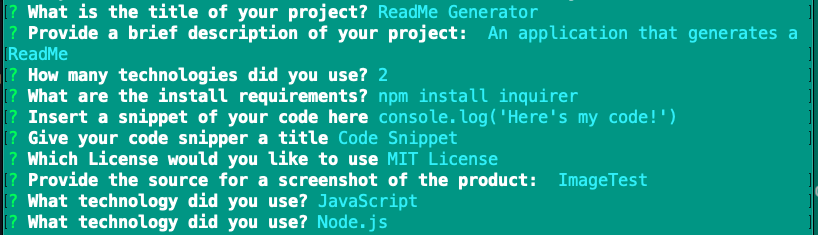

# ReadME Generator

## Description
An application that generates a README

## Table of Contents
* Installation
* Technologies
* Code Snippet
* Usage
* Questions
* License

## Installation
    npm install inquirer

## Technologies
* JavaScript
* Node.js

## What I Did

#### Code Snippet
    console.log('Here's my code!')

## Usage
The following image is an example of the web application's appearance and functionality: 

## Questions
* email@email.com
* [scaredofseagles](https://github.com/scaredofseagles)

## License
MIT License

============================================================

This README was created using a README Generator. See the Repo: [github.com/scaredofseagles/README-Generator](https://github.com/scaredofseagles/README-Generator)

    